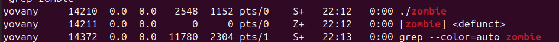

# Actividad 6 - Procesos e Hilos

## Pregunta 1
### ¿Cuántos procesos son creados en total?
- El número total de procesos creados es 8.

### Razon:
Cada llamada a `fork()` genera nuevos procesos. El proceso original más 7 procesos creados da un total de 8.

---

## Pregunta 2
### Código del programa que genera un proceso zombie:
```c
#include <stdio.h>
#include <sys/types.h>
#include <sys/wait.h>
#include <unistd.h>

int main() {
    pid_t pid = fork();

    if (pid > 0) {
        // Proceso padre: espera 60 segundos antes de terminar
        sleep(60);
        wait(NULL);  // Recoge el proceso zombie
    } else if (pid == 0) {
        // Proceso hijo: termina de inmediato
        printf("Proceso hijo ha terminado y es ahora un zombie.\n");
    } else {
        perror("fork");
    }

    return 0;
}
```
### Se verifica el estado del proceso. Se puede ver un proceso con el estado Z+ (zombie). El proceso hijo termina inmediatamente, dejando un zombie que el proceso padre elimina después de 60 segundos.


## Pregunta 3
### ¿Cuántos procesos únicos son creados?
- 2 procesos.
### ¿Cuántos hilos únicos son creados?
- 4 hilos.
